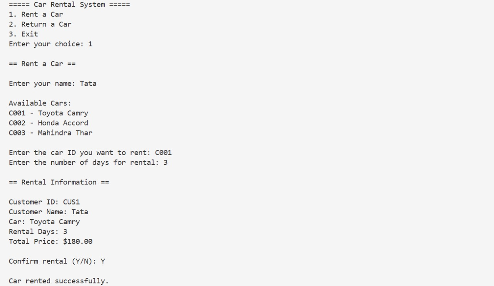
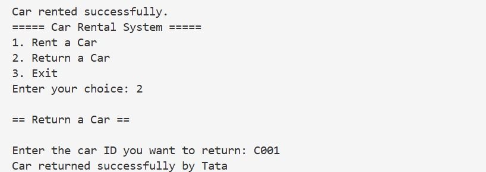
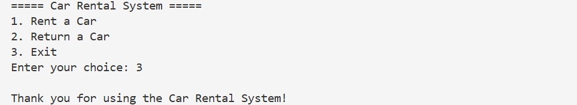

# Car Rental System

A Java-based console application simulating a real-world car rental service. This project was developed to strengthen object-oriented programming concepts and demonstrate the practical application of core Java principles.

## Features

- **Rent a Car**: Allows customers to rent available cars by selecting models and duration.
- **Return a Car**: Updates car availability and calculates rental duration.
- **Customer Management**: Add and manage customer records.
- **Car Inventory Management**: Manage details of available cars, including brand, model, and pricing.
- **Rental History Tracking**: Maintain a record of past rentals, customers, and durations.

## Technologies Used

- Java (OOP concepts)
- IntelliJ IDEA (Development Environment)

## How to Run

1. Clone the repository:
   ```bash
   git clone https://github.com/Gaya3-hue/Car-Rental-System.git
   cd Car-Rental-System

## Screenshots

### Home Page


### Booking Page


### Admin Panel


